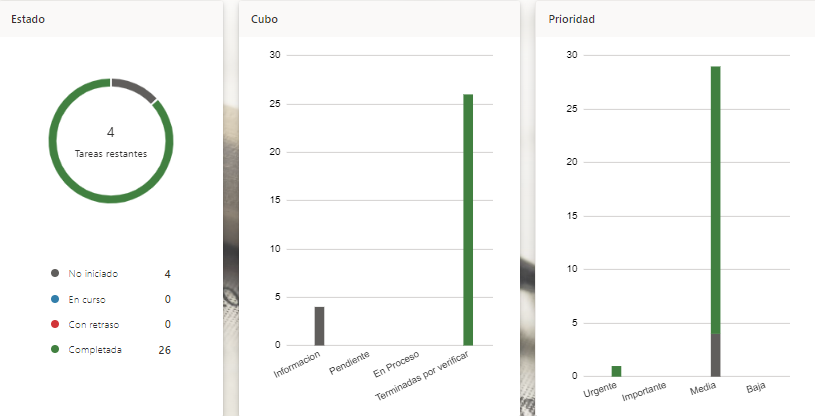
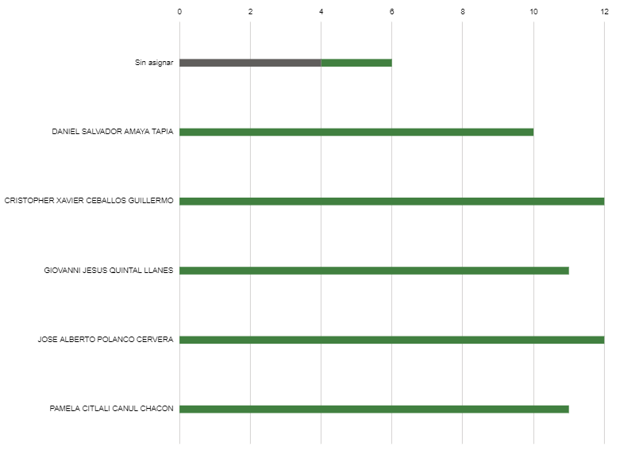

# Human-Computer Interaction 2022
> Universidad Autónoma de Yucatán, Facultad de Matemáticas \
> Professor: Dr. Edgar Antonio Cambranes Martínez

# Team Organization :trophy:

| :camera: | :busts_in_silhouette: | 
| :----: | :---: |
|  | [Cristopher Xavier Ceballos Guillermo](https://github.com/xaviceb99) 
|  | [José Alberto Polanco Cervera](https://github.com/JAlbertPC)
|  | [Daniel Salvador Amaya Tapia](https://github.com/amaya7398)
|  | [Pamela Citlali Canul Chacon](https://github.com/PamelaCanul)
|  | [Giovanni Jesus Quintal LLanes](https://github.com/GiovanniQuintal)

# Project :memo:
Our proposal is a system which helps to generate habits that can prevent or guide teenager to improve the life style and handling true information. 

> ## [Elevator speach](https://youtu.be/L76dXX4eIUI) :arrow_up: :speech_balloon:

## Index :clipboard:

* [Users](#)
    * [Project definition](./Resources/docs/Definicion_del_proyecto.pdf)
    * [Project plan](./Resources/docs/Project_plan.pdf)
    * [Personas](./Resources/docs/pags/personas.md)
    * [Requirements](./Resources/docs/Requirements.pdf)
* [Prototypes](https://www.figma.com/file/n2tGqyWNZ1ZzVXvyFRU6gD/HCI?node-id=186%3A15)
* [Testing]()
    * [Usability Testing Protocol](./Resources/docs/testing/usability_testing_protocol.pdf)
    * [Usability Test Result](./Resources/docs/testing/usability_test_result.pdf)
    * [Results Testing Template](./Resources/docs/testing/results_testing_template.pdf)
    * [Analysis of the Information](./Resources/docs/testing/analysis_of_the_information.pdf)
---
* >[Artifacts](./Resources/docs/pags/artifacts.md)

---
## Project Contribution
[Planner](https://tasks.office.com/alumnos.uady.mx/Home/PlanViews/qoI8X5ntPkya3scLROEdMWQAESO3?Type=PlanLink&Channel=Link&CreatedTime=637890595901600000) , here you can find the plan we work with

 
 

|José Alberto Polanco Cervera - 20% 
|Cristopher Xavier Ceballos Guillermo - 21% 
|Pamela Citlali Canul Chacon - 21%
|Giovanni Jesus Quintal LLanes - 19% 
|Daniel Salvador Amaya Tapia - 19%

## Project Deliveries
* [First Delivery] 
https://youtu.be/kqRk5X8IKmU

* [Second Delivery] 
Video: https://youtu.be/ynl80uIL8Co
Prototypes: https://www.figma.com/file/n2tGqyWNZ1ZzVXvyFRU6gD/HCI?node-id=15%3A1291
Documentation: https://docs.google.com/document/d/1yd1kO1K5XGbKICt4yxxyOLVXAqDWo9yCIA1crRZH-Is/edit#heading=h.x35tlvxy3km

* [Last Delivery] 
Usability test protocol: https://docs.google.com/document/d/1DrP4Gjuqkxe0efHBb0rH4Jq0hJ6UidePG1Fouivjeec/edit?usp=sharing
Results: https://docs.google.com/document/d/15LErGjBkirLhzB0fiRqvnkTWHa0j7ZaorCuA8WVF25Y/edit
Learned lessons: https://docs.google.com/document/d/1LpjGktuPZXEMlD4bAqMsSa05pp7XQJBwTKuaov6uU4Y/edit
Analysis of the information: https://docs.google.com/document/d/1pEDDkpyFuxOp-il3wuLPsSaF9YUL7Ex-hJbiHMQHzCY/edit
