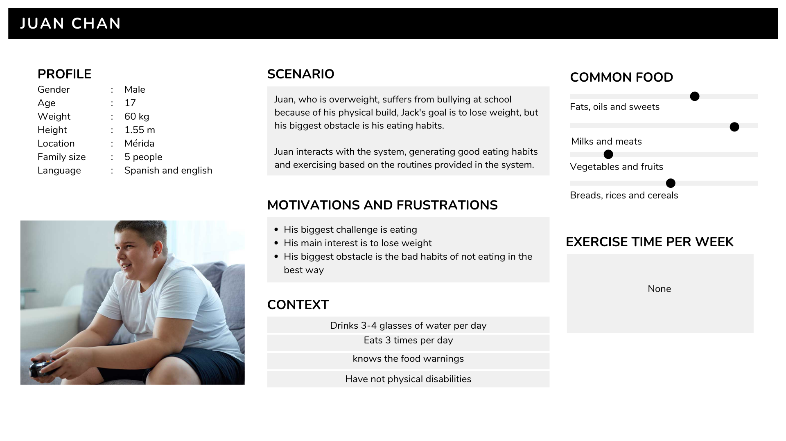
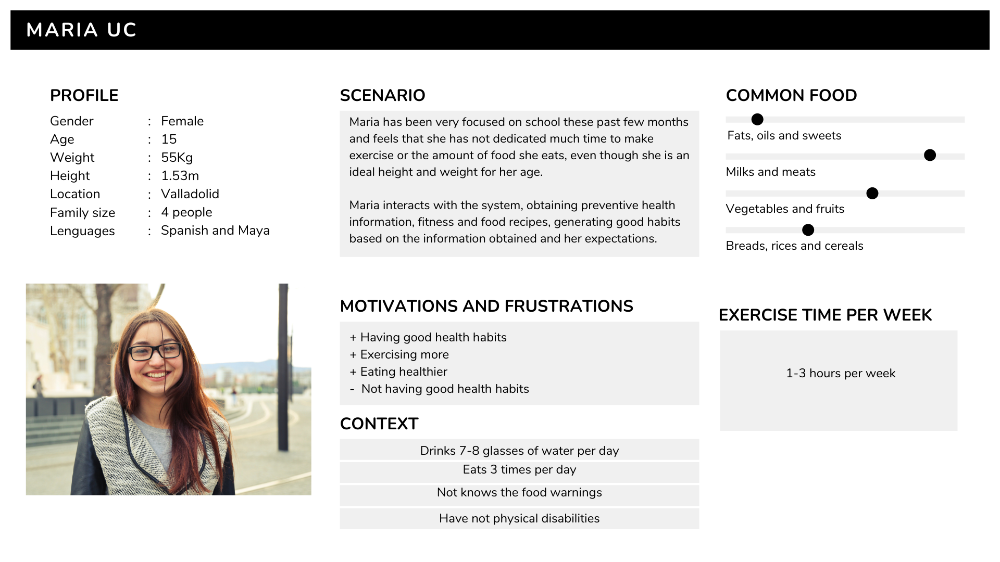

# Perfil de Personas

* Persona's biographic background
    * Geographic profile:
        * City/metropolitan
    * Demographic profile:
        * Age
        * Family size
* Specific goal/needs/attitudes
    * Emotional goals
    * Motivations
    * Needs
    * Frustrations
* Specific Knowledge/Proficiency
    * Language Proficiency
* Sensory/Immersive Characteristics of use
    * Mood/Feeling
    * Memorable
    * Pleasurable
* Accessibility issues
    * Physical abilities/disabilities 
    * Mental abilities/disabilities 

---

# Personas
### Persona 1

### Persona 2
